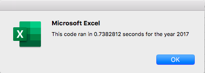
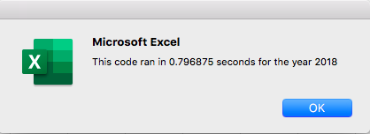
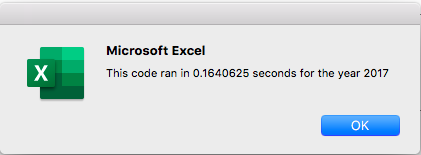
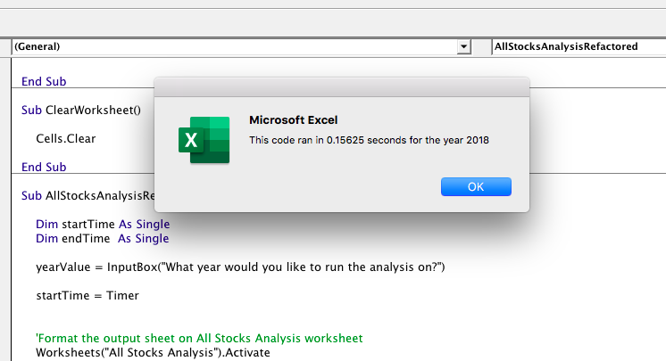

# Stocks-Analysis
Using VBA to perform an analysis on data on stocks 

## Overview of Project 
The purpose of this analysis was to help Steve examine stock data to determine which would be the best for his parents to invest in. Total daily volume and yearly return were the two metrics used to measure stock success. Total daily volume is the total number of shares traded throughout a day. The yearly return % is the difference in price from the beginning and the end of the year. 
	
Steve’s parents were very interested in seeing the success of the DQ stock. Further examining this stock we saw in 2018 DQ had a negative return of 62.6%. This means that owners of this stock had lost money if they owned it from Jan 1st to Dec 31st. This is not ideal when wanting to invest, so I dove deeper into looking at all 12 stocks to see which performed the best. 
	
By utilizing VBA’s tools I created an analysis that Steve or others could run off the spreadsheet using a button. This also allows him to run the analysis for the year of his choice. 

## Results 
In 2017, most stocks had a positive yearly return, except for TERP. DQ had the highest yearly return, with a 199.4% return. However, things were very different in 2018, with most stocks having a negative yearly return. Only ENPH and RUN positive yearly returns. Both stocks had similar yearly returns but RUN had 2.1% more return than ENPH. Their yearly return was 84%. Given both of these stocks had positive yearly returns in 2017 and 2018, they would be the best stocks to invest in. My recommendation is to invest in ENPH stocks. Both had similar return % for 2018, but ENPH had a significantly higher yearly return in 2017 than RUN. In 2017 ENPH had a yearly return of 129.5% while RUN only had one of 5.5%. 

Comparing the original code with the refactored code the refactored code saved time on both years when running the analysis. The original code had an average run time of .768 seconds between both years. The refactored code had an average run time of .16 between both years. 

### Run time for original code:

### Run time for refactored code:

